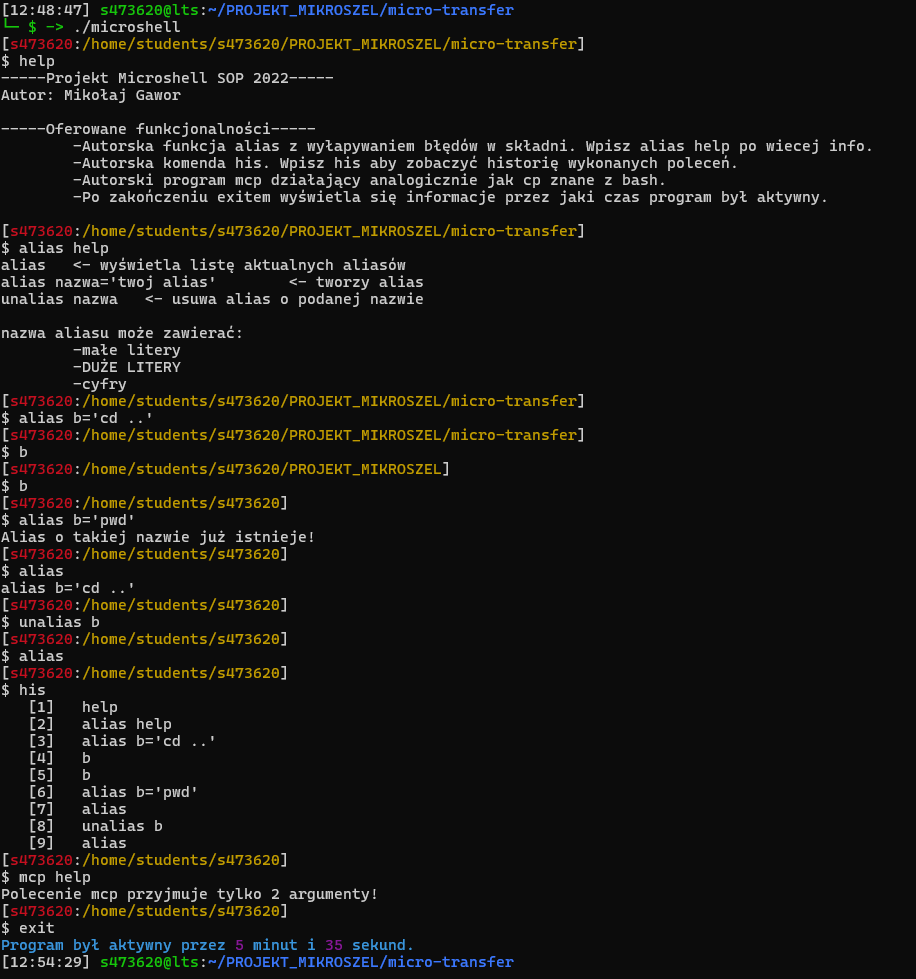

## Projekt Microshell SOP 2022
Autor: Mikołaj Gawor

## Oferowane funkcjonalności
1. Autorska funkcja alias z wyłapywaniem błędów w składni. Wpisz alias help po wiecej info.
2. Autorska komenda his. Wpisz his aby zobaczyć historię wykonanych poleceń.
3. Autorski program mcp działający analogicznie jak cp znane z bash.
4. Po zakończeniu exitem wyświetla się informacje przez jaki czas program był aktywny.

## Screenshot

